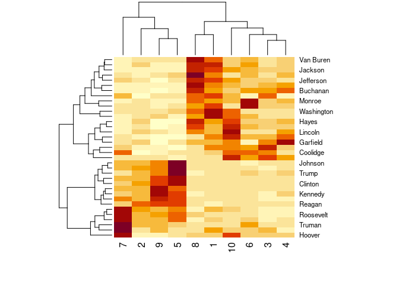

Fitting LDA Models in R
================
Wouter van Atteveldt & Kasper Welbers
2020-03

# Introduction

LDA, which stands for Latent Dirichlet Allocation, is one of the most
popular approaches for probabilistic topic modeling. The goal of topic
modeling is to automatically assign topics to documents without
requiring human supervision. Although the idea of an algorithm figuring
out topics might sound close to magical (mostly because people have too
high expectations of what these ‘topics’ are), and the mathematics might
be a bit challenging, it is actually really simple fit an LDA topic
model in R.

A good first step towards understanding what topic models are and how
they can be usefull, is to simply play around with them, so that’s what
we’ll do here. First, let’s create a document term matrix from the
inaugural speeches in quanteda, at the paragraph level since we can
expect these to be mostly about the same topic:

``` r
library(quanteda)
texts = corpus_reshape(data_corpus_inaugural, to = "paragraphs")
dfm = dfm(texts, remove_punct=T, remove=stopwords("english"))
dfm = dfm_trim(dfm, min_docfreq = 5)
```

To run LDA from a dfm, first convert to the topicmodels format, and then
run LDA. Note the useof `set.seed(.)` to make sure that the analysis is
reproducible.

``` r
library(topicmodels)
dtm = convert(dfm, to = "topicmodels") 
set.seed(1)
m = LDA(dtm, method = "Gibbs", k = 10,  control = list(alpha = 0.1))
m
```

    ## A LDA_Gibbs topic model with 10 topics.

Although LDA will figure out the topics, we do need to decide ourselves
how many topics we want. Also, there are certain hyperparameters (alpha)
that we can tinker with to have some control over the topic
distributions. For now, we won’t go into details, but do note that we
could also have asked for 100 topics, and our results would have been
much different.

## Inspecting LDA results

We can use `terms` to look at the top terms per
topic:

``` r
terms(m, 5)
```

| Topic 1 | Topic 2   | Topic 3    | Topic 4 | Topic 5 | Topic 6 | Topic 7 | Topic 8    | Topic 9 | Topic 10   |
| :------ | :-------- | :--------- | :------ | :------ | :------ | :------ | :--------- | :------ | :--------- |
| people  | years     | government | states  | us      | war     | world   | government | us      | government |
| upon    | world     | public     | united  | one     | nations | must    | every      | can     | congress   |
| shall   | time      | revenue    | people  | america | peace   | can     | states     | new     | law        |
| may     | president | business   | now     | every   | foreign | peace   | union      | world   | shall      |
| public  | new       | must       | great   | must    | united  | freedom | people     | let     | upon       |

The `posterior` function gives the posterior distribution of words and
documents to topics, which can be used to plot a word cloud of terms
proportional to their occurrence:

``` r
topic = 6
words = posterior(m)$terms[topic, ]
topwords = head(sort(words, decreasing = T), n=50)
head(topwords)
```

    ##        war    nations      peace    foreign     united     states 
    ## 0.02292936 0.02202018 0.01838349 0.01420129 0.01129194 0.01092827

Now we can plot these words:

``` r
library(wordcloud)
wordcloud(names(topwords), topwords)
```

<!-- -->

We can also look at the topics per document, to find the top documents
per topic:

``` r
topic.docs = posterior(m)$topics[, topic] 
topic.docs = sort(topic.docs, decreasing=T)
head(topic.docs)
```

    ##   1813-Madison.5 1889-Harrison.18   1813-Madison.7   1949-Truman.39 
    ##        0.9608696        0.8741935        0.8714286        0.8714286 
    ##     1909-Taft.21   1949-Truman.25 
    ##        0.8310345        0.8294118

And we can find this document in the original texts by looking up the
document id in the document variables `docvars`:

``` r
docs = docvars(dfm)
topdoc = names(topic.docs)[1]
docid = which(docnames(dfm) == topdoc)
texts[docid]
```

    ## Corpus consisting of 1 document and 4 docvars.
    ## 1813-Madison :
    ## "As the war was just in its origin and necessary and noble in..."

Finally, we can see which president prefered which topics:

``` r
docs = docs[docnames(dfm) %in% rownames(dtm), ]
tpp = aggregate(posterior(m)$topics, by=docs["President"], mean)
rownames(tpp) = tpp$President
heatmap(as.matrix(tpp[-1]))
```

<!-- -->

As you can see, the topics form a sort of ‘block’ distribution, with
more modern presidents and older presidents using quite different
topics. So, either the role of presidents changed, or language use
changed, or (probably) both.

To get a better fit of such temporal dynamics, see the session on
*structural topic models*, which allow you to condition topic
proportions and/or contents on metadata covariates such as source or
date.

## Visualizing LDA with LDAvis

`LDAvis` is a nice interactive visualization of LDA results. It needs
the LDA and DTM information in a slightly different format than what’s
readily available, but you can use the code below to create that format
from the lda model `m` and the `dtm`:

``` r
dtm = dtm[slam::row_sums(dtm) > 0, ]
phi = as.matrix(posterior(m)$terms)
theta <- as.matrix(posterior(m)$topics)
vocab <- colnames(phi)
doc.length = slam::row_sums(dtm)
term.freq = slam::col_sums(dtm)[match(vocab, colnames(dtm))]

library(LDAvis)
json = createJSON(phi = phi, theta = theta, vocab = vocab,
     doc.length = doc.length, term.frequency = term.freq)
serVis(json)
```
